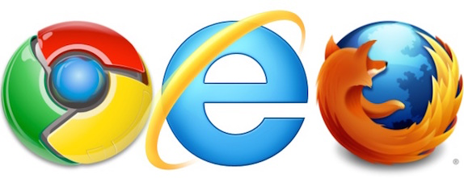

#Note

- When using these labs you can navigate backwards and forwards through each lab, theres no restrictions in place.

##Module 

When you log into Moodle with your normal WIT username and password, you  will see the Moodle Labs Module, in there you should see the "Re-Boot your Module" section, click to open the section.

Open **Lab 01 - Emgage* if you notice in your web browser you should have a new tab, working with tabs in your browser window allows you to work in several different systems at the same time, i.e. search in one tab, Moodle in another tab, and Bootstrap in another, you just need to be aware of which tab is for which system.

##Some Basics First

In this lab we will learn which web browser we will use together with some basics of bootstrap along with the process of taking bootstrap and integrating it with moodle 

##Web Browsers

Web browsers allow us to retrive and browse content on the world wide web, we can makre requests for a web site by typing in a web address of the web site that we are alooking for i.e. Moodle, Gmail, RTE, Irish Time etc.

This is the WIT Moodle site, and as you can see the web address of the moodle web site is in the address bar, remember this because will use the web address of different resources later.

##Web Browser Types

There are different types of web browsers, you will be familiar with the more popular one such as Google Chrome, Mozilla Firefox, Internet Explorer, have a look at the images below, we recommend Google Chrome.

Google Chrome works best with Moodle and is the web browser that we will use in these labs

